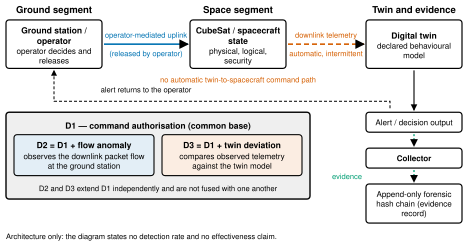

<h1 align="center">LIFESAT</h1>

<p align="center">
  Simulation code and analysis for a forensic-ready digital twin framework
  for cybersecurity in LEO CubeSats
</p>

<p align="center">
  <a href="https://doi.org/10.5281/zenodo.22262544"></a>
  
  
  
  
</p>

<p align="center">
  
</p>

<p align="center">
  <sub>Data flow and defence layering, Figure 1 of the paper. Architecture only:
  the diagram states no detection rate and no effectiveness claim.</sub>
</p>

The framework separates three questions that anomaly detection in a spacecraft
usually merges: whether a command is authentic, whether the received state is
consistent with what the ground approved, and whether a candidate configuration
update is safe before it is uplinked. Contact with a LEO CubeSat is intermittent,
so the twin predicts across the gap and the admissible deviation grows with the
elapsed observation gap rather than staying fixed.

## Repository layout

Two experiment generations produced the results in the paper. They use different
scoring contracts and are kept apart on purpose.

| directory | produces | runs |
|---|---|---|
| `matrix-2026-07/` | the historical detection matrix | 20 cells x 60 seeds = 1,200 |
| `causal-2026-08/` | the cause-discrimination fleet and the twin ablation | 1,116 inferential + 288 robustness = 1,404 |
| `dtaas/` | the on-demand twin instantiation service | deployment demonstration |

Running a matrix cell under `causal-2026-08/` will not reproduce the matrix
numbers, and the reverse is also true. Each directory reproduces its own results.

Both directories hold the tree that actually produced the published results.
For the cause-discrimination fleet this is the frozen producer rather than its
later hardened successor. What a rerun does and does not reproduce, and why the
published digest differs from the recorded one, is set out in
`causal-2026-08/README.md`.

Neither directory reproduces the figures and tables in the paper. The scripts
that built those read from a working layout outside this repository and were
not included.

## Requirements

- OMNeT++ 6.4.0
- INET 4.7.0
- C++17 compiler
- Python 3.10 or later
- `sgp4==2.27`, for the independent orbital-contact check only

## Install from scratch

### 1. System packages

Debian and Ubuntu:

```bash
sudo apt install build-essential clang bison flex perl python3 python3-pip \
                 python3-venv libxml2-dev zlib1g-dev
```

macOS:

```bash
brew install bison flex libxml2
```

Xcode command line tools provide the compiler. On Windows, use WSL2 with
Ubuntu and follow the Debian steps; the native toolchain that ships with
OMNeT++ also works, but the analysis scripts assume a POSIX shell.

Nothing here needs the OMNeT++ IDE or the Qt graphical environment. The runs
are launched with `Cmdenv`, so the `-core` distribution is enough and Qt is not
a dependency.

### 2. OMNeT++ and INET

Download `omnetpp-6.4.0-core.tgz` from the OMNeT++ 6.4.0 release and
`inet-4.7.0-src.tgz` from the INET 4.7.0 release, unpack both, then:

```bash
cd omnetpp-6.4.0 && source setenv && ./configure WITH_QTENV=no WITH_OSG=no && make -j$(nproc)
cd ../inet-4.7.0  && source setenv && make makefiles && make -j$(nproc) MODE=release
```

`source setenv` must be sourced, not piped: `source setenv | tail` runs it in a
subshell and the environment never reaches your shell.

### 3. Python packages

One package is needed, and only for the independent orbital-contact check. A
virtual environment inside the experiment directory is picked up automatically
by `setenv`:

```bash
cd lifesat/matrix-2026-07          # and again in causal-2026-08
python3 -m venv .venv
./.venv/bin/pip install -r ../requirements.txt
```

Without it the R2 gate stops with a message naming the package. Everything
else, including the build and the other gates, runs on a bare Python 3.10.

## Build and run

```bash
export OMNETPP_ROOT=/path/to/omnetpp-6.4.0
export INET_ROOT=/path/to/inet-4.7.0
cd matrix-2026-07        # or causal-2026-08
source ./setenv
make MODE=release -j$(nproc)
```

Reproduction commands and expected values are in each directory's own README.

## Scope

The evaluation is simulation-based. No result was obtained on flown hardware.
RF propagation realism, flight-software timing and operational ground-station
procedure are not represented. Cause discrimination holds within six predeclared
matched symptom classes, five of which take their episode boundaries from
declared truth, so the evaluation is truth-windowed and is not interpretable as
operational diagnosis.

"Forensic-ready" and "full-lifecycle" are framework-scope labels. They do not
mean that end-to-end technical, organisational or legal forensic readiness was
demonstrated.

## Data

This repository holds source, configuration and the TLE input. It does not hold
run outputs.

The raw forensic records, the scored result sets, the sealed contract packages
and the twin-ablation evaluator are deposited separately, because they are large
and because several of them are identified by the digest of their bytes rather
than by their text. The deposit is the citable companion to this repository:

    https://doi.org/10.5281/zenodo.22262544

That link always resolves to the newest version. `causal-2026-08/README.md`
lists the environment variables that point the analysis at the sealed packages
once you have unpacked them.

### Frozen artefacts keep their original bytes

Three files in this repository are identified by the digest of their bytes and
are published exactly as the experiments loaded them, not reformatted:

| file | pinned by |
|---|---|
| `matrix-2026-07/results/d2_thresholds.txt` | the paper, by SHA-256 |
| `matrix-2026-07/simulations/lifesat.ini` | `config_sha256` in the ablation provenance record |
| `causal-2026-08/simulations/lifesat.ini` | the same digest |
| `causal-2026-08/analysis/score.py` | `scorer` pin in `build_corrected_package_v1.py` |
| `causal-2026-08/analysis/scoring/output.py` | the same composite digest |

The last two are hashed together with the other eight files of the scoring
package into one digest, `de16e29c…`, which the corrected-package build refuses
to proceed without.

Their comment lines are in the author's working language rather than English.
That is deliberate. Translating a comment changes the bytes, which changes the
digest, which would make the published provenance records false. The numeric
content of these files is unaffected and is documented in English elsewhere.

The same rule applies to the sealed contract packages in the deposit: they are
published as accepted, including their internal process notes, because their
identity is the digest of their bytes.

### Reproducing Tables 11 to 14

The corrected production chain rebuilds the paper's Tables 11 to 14 from the
1,200 historical raw records plus the 180 reruns for A1-D3, A2-D3 and A3-D3.
Unpack the code archive, the raw matrix, the sealed contracts and the
corrected-package inputs, then arrange them as the build expects:

```bash
SIM=lifesat-1.0.2/causal-2026-08
cp -r results              $SIM/                 # raw-matrix archive
cp -r results-v2-iss06     $SIM/                 # corrected-package-inputs
mkdir -p $SIM/specs && cp arsiv/specs-sealed/*.json arsiv/specs-sealed/*.md $SIM/specs/
mkdir -p verification && cp ISS06_FLEET_VERIFICATION.json verification/

cd $SIM/analysis
LIFESAT_SPECS=$PWD/../specs \
LIFESAT_SEAL=/path/to/ACCEPTANCE_SEAL.json \
python3 build_corrected_package_v1.py
```

It refuses to run unless five pins hold: the contract JSON, the acceptance
seal, the composite scorer digest, the historical raw tree and the rerun tree.
On success it prints `"verdict": "GREEN"` with 1,200 selected runs over 20
cells and writes `results-v2-corrected/`, whose `CORRECTED_RESULTS.json`
carries the Table 11 values:

| cell | precision | recall | FPR |
|---|---|---|---|
| B0-D3 | 0.0000 | undefined | 0.0016 |
| A1-D3 | 0.0000 | undefined | 0.0020 |
| A2-D3 | 0.0000 | undefined | 0.0018 |
| A3-D3 | 0.0000 | undefined | 0.0018 |
| A4-D3 | 0.8081 | 0.9161 | 0.0020 |

and the Table 14 layer rates, 0.9965 for modification and 0.7996 for delay.

### Two scoring layers, and which one the paper reports

`matrix.json` in the deposit is the **historical layer**. It is what the scorer
in `matrix-2026-07/analysis/score.py` produces from the 1,200 raw records, and
rescoring reproduces it exactly, 1,200 of 1,200.

**It is not the object the paper's Tables 11 to 14 report.** Those tables use a
corrected F3 ontology, stated in section 6.1 of the paper: a command-side effect
begins only when a uniquely matched hostile *acceptance* changes the prevailing
value. Under D1, hostile commands are rejected before acceptance, so no effect
opens, the truth-positive denominator is absent, and direct D3 recall is
reported as `undefined` rather than as a number. The rejection evidence is
reported separately as F4.

The historical scorer does not make that distinction and credits D3 with
detecting commands D1 had already blocked. The two objects therefore disagree
for cells B0, A1, A2 and A3, by design. For example, the historical layer gives
A1-D3 seed 0 as tp=8, fp=1, recall=1.0, precision=0.8889, while Table 11 gives
precision 0.0000 and recall `undefined` for the same cell.

The corrected production chain, its sealed contract, the accepted tools package
and the reruns it consumes are in the deposit under `arsiv/` and
`accepted_phase2_v7/`. They are published exactly as accepted, not reformatted,
because their identity is the digest of their bytes and the pins are recorded in
`causal-2026-08/analysis/causal/authority.py`.

## Citation

This code supports

> Efe Cam, "A Forensic-Ready Digital Twin Framework for Full-Lifecycle
> Cybersecurity in LEO CubeSats", 77th International Astronautical Congress
> (IAC 2026), Antalya, Turkiye, 5 to 9 October 2026. Paper IAC-26-D5.4.11.

If you use this code or the deposited result sets in academic work, please
cite that paper and the deposit:

> https://doi.org/10.5281/zenodo.22262544
 `CITATION.cff` carries the same
information in machine-readable form, and GitHub renders it as a
"Cite this repository" button.

## License

MIT, see `LICENSE`. The licence requires that the copyright and licence
notices are preserved in copies and substantial portions. It does not by
itself require academic citation; the request above does.

The simulator and its model library are separate works with their own terms:
OMNeT++ 6.4.0 is distributed under the Academic Public License, which is free
for academic and other non-commercial use, and INET 4.7.0 under the LGPL-3.0.
Neither is included here; both are obtained separately, and running this code
requires accepting their terms.

## Citation

See `causal-2026-08/CITATION.cff`.
